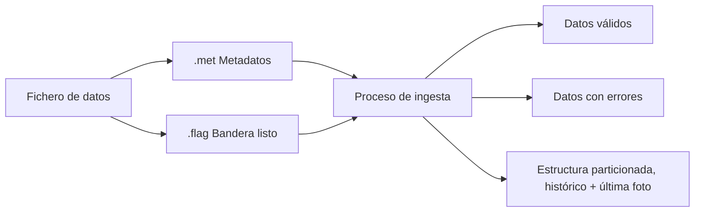
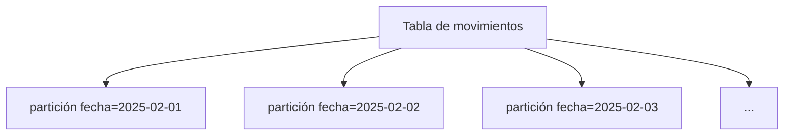

# Guía de usuario – Ingesta de ficheros

## 1. Introducción

El objetivo de esta guía es explicar **cómo utilizar el módulo de ingesta de ficheros** para cargar datos en el Data Lake de forma controlada y con calidad.

Al finalizar la lectura, el usuario será capaz de:

- Preparar los ficheros necesarios para una ingesta.
- Definir el fichero de metadatos `.met` que describe el contenido.
- Configurar reglas de calidad básicas.
- Entender la salida de la ingesta, incluida la separación entre registros correctos e incorrectos.
- Comprender la estructura de particionamiento para poder consultar siempre la **“última foto”** de la información.

Esta guía **no entra en detalles técnicos internos** (clases, ficheros de configuración del sistema, etc.). Se centra en **qué debe hacer y entender el usuario final**.

---

## 2. Visión general del proceso

### 2.1. Idea general

El proceso de ingesta de ficheros sigue, a alto nivel, estos pasos:

1. Un sistema de origen genera un fichero de datos (por ejemplo, operaciones diarias de clientes).
2. El usuario (o un proceso batch) prepara:
   - El fichero de **datos**.
   - El fichero de **metadatos** `.met`.
   - El fichero **bandera** `.flag`.
3. El proceso de ingesta:
   - Comprueba que los ficheros están completos y tienen el formato esperado.
   - Aplica, si existen, **reglas de calidad** definidas en el `.met`.
   - Mueve los datos a una ubicación estructurada dentro del Data Lake, preparada para ser consultada.
4. El usuario puede consultar:
   - El histórico de datos.
   - La “última foto” (último día o periodo cargado).
   - Y, si hay calidad, los registros correctos (OK) y los erróneos (KO).

### 2.2. Ficheros implicados y su importancia

En cada ingesta intervienen **tres ficheros coordinados**:

- **Fichero de datos**  
  Contiene la información que se quiere cargar (por ejemplo, movimientos, operaciones, clientes, etc.).

- **Fichero de metadatos `.met`**  
  Es un fichero JSON que **describe la estructura** del fichero de datos:
  - Columnas.
  - Tipos de datos.
  - Reglas de calidad.
  - Otras características (separador, formato de fecha, etc.).

- **Fichero bandera `.flag`**  
  Es un fichero muy ligero (incluso puede estar vacío) que solo indica:
  > "Este fichero de datos está completo y listo para ser ingerido".

El proceso de ingesta trabaja con los ficheros de datos que tienen al menos su `.flag` correspondiente:

- **Primera ingesta de un dataset** (nueva combinación de base de datos y tabla): es necesario que exista también un `.met` para registrar la estructura inicial.
- **Ingestas posteriores**: si no se envía un `.met` nuevo, se reutiliza la última versión archivada para ese dataset; si se envía un `.met` nuevo, se valida frente al anterior y, si es compatible, pasa a ser la nueva versión.

### 2.3. Diagrama de flujo alto nivel



---

## 3. Cómo preparar los ficheros de datos

### 3.1. Formato del fichero de datos

El módulo de ingesta está pensado para trabajar con ficheros **tabulares**, típicamente:

- CSV (valores separados por comas u otro delimitador).
- DAT (mismo concepto, pero con extensión distinta).
- En algunos casos, JSON línea a línea.

Recomendaciones:

- **Codificación**: usar UTF-8 siempre que sea posible.
- **Separador**: definir un separador claro (por ejemplo `,` o `;`) y reflejarlo en el `.met`.
- **Cabecera**:
  - Si el fichero tiene cabecera (nombres de columnas en la primera línea), indicarlo en el `.met`.
  - Si no tiene cabecera, asegurarse de que el orden de columnas coincide con el definido en el `.met`.

### 3.2. Convención de nombres

Cada fichero de datos debe seguir una convención que incluya **una fecha en el nombre**. A nivel de usuario, la recomendación es:

```text
<prefijo>_<YYYY-MM-DD>.<extensión>
```

Ejemplos:

- `movimientos_2025-03-15.csv`
- `clientes_2025-02-01.dat`

Normas básicas:

- Debe existir un **guion bajo `_`** antes de la fecha.
- La fecha debe ser **válida**:
  - `2025-02-15` es válida.
  - `2025-22-44`, `20250215` o `2025_02_15` no lo son.

Si el nombre no cumple esta convención, el proceso considera el fichero **inválido** y lo envía a una ruta de error (para que pueda revisarse y corregirse).

### 3.3. Trío de ficheros por día

Para la **primera ingesta de un nuevo dataset** (nueva combinación de base de datos y tabla) se recomienda preparar **tres ficheros con el mismo prefijo y fecha**:

- `movimientos_2025-03-15.csv`   → datos.
- `movimientos_2025-03-15.met`   → metadatos.
- `movimientos_2025-03-15.flag`  → bandera.

En ingestas posteriores, puedes enviar solo el fichero de datos y el `.flag` si la estructura no cambia. Si no llega un `.met` nuevo, el proceso reutiliza la última versión de metadatos disponible para ese dataset.  
Solo fallará cuando **no exista ni `.met` nuevo ni una versión histórica previa**, es decir, en el primer día en el que intentas ingestar un dataset sin haber definido antes sus metadatos.

---

## 4. El fichero `.met`: descripción del contenido

### 4.1. Qué es el `.met`

El `.met` es un fichero en formato **JSON** que describe:

- Cómo leer el fichero de datos.
- Qué columnas tiene y qué tipo de información almacena cada una.
- Qué reglas de calidad se deben aplicar.
- Opcionalmente, cómo transformar o reemplazar ciertos valores (por ejemplo, códigos a descripciones).

Se puede ver como el **“contrato”** entre el fichero de datos y el Data Lake.

### 4.2. Estructura básica

A alto nivel, un `.met` suele contener:

- **Información general del fichero**:
  - Tipo de fichero (`CSV`, `DAT`, `JSON`).
  - Separador (`,`, `;`, `|`, etc.).
  - Si tiene cabecera (`true/false`).

- **Lista de columnas** (`columns`):
  - Nombre de la columna.
  - Tipo de dato (texto, número, fecha, etc.).
  - Si admite valores nulos.
  - Comentario descriptivo.
  - Reglas de calidad asociadas.

### 4.3. Ejemplo sencillo de `.met`

Supongamos un fichero de movimientos con estas columnas:

- `fecha_operacion`: fecha de la operación.
- `importe`: importe monetario.
- `tipo_operacion`: por ejemplo, `INGRESO`, `REINTEGRO`, `TRANSFERENCIA`.

Un `.met` simplificado podría ser:

```json
{
  "generationDate": "2025-03-24",
  "fileType": "CSV",
  "delimiter": ",",
  "hasHeader": true,
  "columns": [
    {
      "name": "fecha_operacion",
      "type": "date",
      "nullable": false,
      "comment": "Fecha de la operación",
      "quality": {
        "notNull": true,
        "dateFormat": "yyyy-MM-dd"
      }
    },
    {
      "name": "importe",
      "type": "decimal",
      "nullable": false,
      "comment": "Importe de la operación",
      "quality": {
        "notNull": true
      }
    },
    {
      "name": "tipo_operacion",
      "type": "string",
      "nullable": false,
      "comment": "Tipo de operación (INGRESO, REINTEGRO, TRANSFERENCIA)",
      "quality": {
        "notNull": true,
        "notEmpty": true
      }
    }
  ]
}
```

### 4.4. Buenas prácticas al evolucionar el `.met`

Cuando el fichero cambia, el `.met` debe evolucionar de forma **controlada**:

- **Cambios recomendados**:
  - Añadir **nuevas columnas al final** de la lista.
  - Modificar comentarios o descripciones.
  - Actualizar la `generationDate`.

- **Cambios delicados** (conviene evitarlos si es posible):
  - Borrar columnas.
  - Renombrar columnas existentes.
  - Cambiar tipos de datos de una columna que ya se está utilizando.
  - Reordenar columnas.

Estos cambios pueden dificultar la consulta del histórico o romper compatibilidades con procesos existentes.

---

## 5. Reglas de calidad: cómo se definen y qué generan

### 5.1. Tipos de reglas habituales

En la sección `quality` de cada columna se pueden definir reglas como:

- `notNull`: el campo no puede ser nulo.
- `notEmpty`: el campo no puede estar vacío (aplicable a texto).
- `regex`: el valor debe cumplir una expresión regular.
  - Ejemplo: números con hasta dos decimales.
- `dateFormat`: el valor debe cumplir un formato de fecha determinado.

También pueden definirse **reemplazos de valores** (`replacements`), por ejemplo:

- Convertir códigos (`"A"`, `"I"`) en descripciones completas (`"ACTIVO"`, `"INACTIVO"`).

### 5.2. Ejemplo extendido de `.met` con calidad

```json
{
  "generationDate": "2025-03-24",
  "fileType": "CSV",
  "delimiter": ",",
  "hasHeader": true,
  "columns": [
    {
      "name": "fecha_operacion",
      "type": "date",
      "nullable": false,
      "comment": "Fecha de la operación",
      "quality": {
        "notNull": true,
        "dateFormat": "yyyy-MM-dd"
      }
    },
    {
      "name": "importe",
      "type": "decimal",
      "nullable": false,
      "comment": "Importe de la operación",
      "quality": {
        "notNull": true,
        "regex": "^\\d+(\\.\\d{1,2})?$"
      }
    },
    {
      "name": "tipo_operacion",
      "type": "string",
      "nullable": false,
      "comment": "Tipo de operación",
      "quality": {
        "notNull": true,
        "notEmpty": true,
        "regex": "^(INGRESO|REINTEGRO|TRANSFERENCIA)$"
      }
    },
    {
      "name": "estado",
      "type": "string",
      "nullable": true,
      "comment": "Estado del registro",
      "replacements": [
        { "from": "A", "to": "ACTIVO" },
        { "from": "I", "to": "INACTIVO" }
      ]
    }
  ]
}
```

### 5.3. Qué salida genera la calidad

Cuando se definen reglas de calidad, el proceso puede generar, conceptualmente, **tres tipos de resultados**:

- **Datos válidos (OK)**  
  Registros que **cumplen todas las reglas de calidad**.  
  Estos son los datos que se consideran “aptos” para uso analítico y que se integran con normalidad en los procesos posteriores.

- **Datos con errores (KO)**  
  Registros que **no cumplen alguna regla**.  
  Se guardan en un dataset separado que incluye:
  - Los campos originales.
  - Información sobre el **motivo del rechazo** (por ejemplo: "importe vacío", "fecha en formato incorrecto", "código de operación no admitido", etc.).

- **Evaluación de umbrales de calidad (opcional)**  
  A nivel de proceso se puede establecer que se exige, por ejemplo, un **95% de registros válidos**.  
  Si no se alcanza ese umbral:
  - La ingesta puede considerarse **fallida**.
  - El conjunto de datos se marca como no apto para su uso habitual hasta que se revise.

### 5.4. Cómo interpretar los resultados

Después de una ingesta con calidad, el usuario debería preguntarse:

- ¿Qué porcentaje de registros ha quedado en OK frente a KO?
- ¿Cuáles son los **errores más frecuentes**?
- ¿Son errores de datos de origen (que hay que corregir en el sistema fuente) o errores de reglas demasiado estrictas?

Esta información permite **mejorar progresivamente la calidad** del dato a lo largo del tiempo.

---

## 6. Particionamiento y “última foto”

### 6.1. Por qué se particiona

Los datos ingeridos se organizan siguiendo una **estructura de particionamiento**, habitualmente por fecha.  
Esto permite:

- Consultar el histórico con eficiencia (por ejemplo, todos los movimientos de un mes).
- Acceder rápidamente a la **información más reciente** (la “última foto”).
- Reducir tiempos de lectura y costes, al no tener que escanear todos los datos históricos en cada consulta.

### 6.2. Esquema conceptual de particionamiento

Aunque la estructura física exacta depende de la plataforma, la idea puede representarse así:



Cada **partición** agrupa los registros pertenecientes a una misma fecha (habitualmente, la fecha del fichero o una fecha de operación relevante).

### 6.3. Cómo consultar la “última foto”

La “última foto” equivale a la partición cuya **fecha es la más reciente**.

A nivel de concepto:

1. Entre todas las particiones disponibles (`fecha=2025-02-01`, `fecha=2025-02-02`, `fecha=2025-02-03`, …), se identifica la **fecha máxima**.
2. Se consultan solo los datos correspondientes a esa fecha.

Ejemplo conceptual (no ligado a un motor concreto):

- Determinar la fecha máxima disponible en la tabla.
- Filtrar los registros donde la columna de partición (`fecha`, `dia_carga`, etc.) coincide con esa fecha.

De este modo, el usuario obtiene siempre la visión más reciente de los datos **sin mezclarla** con históricos.

### 6.4. Consultas históricas

Del mismo modo, se pueden realizar consultas históricas:

- Rango de fechas:  
  "Dame todos los datos entre el 1 y el 15 de marzo de 2025".
- Comparación de fotos:  
  "Compara la cartera de clientes a fecha de cierre de enero con la de febrero".

El particionamiento hace que estas operaciones sean **naturales y eficientes**.

---

## 7. Receta práctica: crear una nueva ingesta

En esta sección se resume, de forma operativa, qué debe hacer el usuario para poner en marcha una nueva ingesta.

### 7.1. Paso 1 – Definir el caso de uso

- Identificar:
  - Qué información se quiere cargar (movimientos, cuentas, clientes, etc.).
  - Cada cuánto se recibe el fichero (diario, semanal, mensual).
  - Qué columnas contiene el fichero y qué significan.

### 7.2. Paso 2 – Diseñar el fichero de datos

- Acordar con el equipo de origen:
  - Formato (CSV, DAT, JSON línea a línea).
  - Separador.
  - Presencia o no de cabecera.
- Preparar un **fichero de ejemplo** con datos realistas.

### 7.3. Paso 3 – Construir el `.met`

A partir del ejemplo de datos:

- Enumerar columnas, tipos y descripciones.
- Definir el `fileType`, el `delimiter` y si `hasHeader` es `true` o `false`.
- Completar un `.met` siguiendo el modelo descrito en esta guía.

Si es la primera vez, es recomendable:

- Partir de una **plantilla** genérica.
- Revisar el `.met` con el equipo de plataforma o de datos antes de ponerlo en producción.

### 7.4. Paso 4 – Añadir reglas de calidad (opcional pero recomendable)

- Identificar los campos **críticos**:
  - Identificadores de cliente.
  - Fechas de operación.
  - Importes.
- Añadir reglas mínimas:
  - Que no sean nulos.
  - Que tengan el formato correcto.
  - En su caso, que estén dentro de un conjunto de valores permitido.

Definir reglas de calidad básicas suele evitar problemas posteriores de análisis y reporting.

### 7.5. Paso 5 – Preparar los ficheros para una jornada de prueba

Para una fecha de prueba (por ejemplo, `2025-03-15`), generar:

- `mi_dataset_2025-03-15.dat` (o `.csv`).
- `mi_dataset_2025-03-15.met` (con la descripción completa).
- `mi_dataset_2025-03-15.flag`.

Estos tres ficheros deben depositarse en la carpeta de entrada acordada con el equipo de plataforma.

### 7.6. Paso 6 – Ejecutar la ingesta

La ejecución técnica (comando, job, etc.) suele estar gestionada por:

- El equipo de plataforma.
- O un sistema de orquestación (scheduler).

El usuario debe conocer:

- Cómo identificar su **dataset** dentro del catálogo del Data Lake.
- Qué **parámetros funcionales** se han utilizado:
  - Base de datos lógica.
  - Nombre de la tabla.
  - Columna de partición (por ejemplo, `fecha`).

### 7.7. Paso 7 – Revisar resultados

Tras la ingesta:

- Verificar que:
  - La partición de la fecha de prueba aparece correctamente.
  - El número de registros cargados es el esperado.

- Si hay calidad:
  - Comprobar el volumen de registros OK y KO.
  - Revisar las causas de error más frecuentes.
  - Decidir si hay que:
    - Corregir datos de origen.
    - Ajustar reglas de calidad.
    - O aceptar la situación como válida.

---

## 8. Anexos

### 8.1. Plantilla básica de `.met`

```json
{
  "generationDate": "YYYY-MM-DD",
  "fileType": "CSV",
  "delimiter": ",",
  "hasHeader": true,
  "columns": [
    {
      "name": "columna_1",
      "type": "string",
      "nullable": false,
      "comment": "Descripción de columna_1",
      "quality": {
        "notNull": true,
        "notEmpty": true
      }
    },
    {
      "name": "columna_2",
      "type": "decimal",
      "nullable": true,
      "comment": "Descripción de columna_2"
    }
  ]
}
```

### 8.2. Glosario

- **Fichero de datos**: fichero que contiene las filas y columnas de información a cargar.
- **`.met`**: fichero JSON que describe la estructura y calidad del fichero de datos.
- **`.flag`**: fichero que indica que el fichero de datos está completo y listo para ser ingerido.
- **Calidad (OK/KO)**: clasificación de los registros según cumplan o no las reglas definidas.
- **Partición**: agrupación lógica de datos por un campo clave (normalmente fecha).
- **Última foto**: conjunto de datos correspondiente a la partición más reciente disponible.
